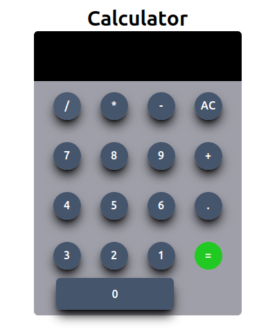

# Calculator

  simple calculator which is created using 
    <ol>
      <li>Html</li>
      <li>CSs</li>
      <li>javascript</li>
    </ol>
  Functationality basic
  <ul>
    <li>addition</li>
    <li>multiplication</li>
    <li>division</li>
    <li>subtraction</li>
    
  </ul>

